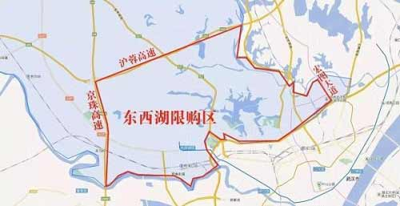
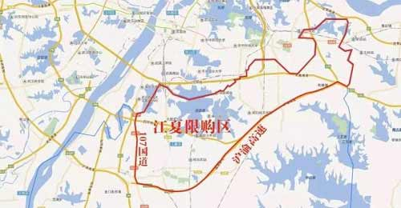
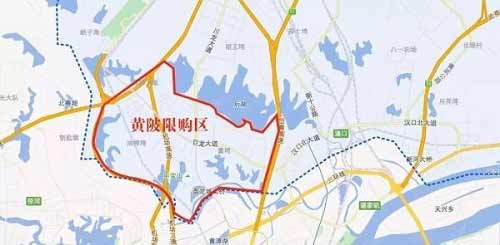
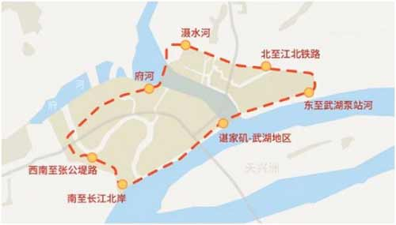

# 为什么最好别买带底商的房子？5大硬伤难解决，住久了很糟心

1、公摊面积大

2、噪音大

3、一般高价买入，低价卖出

4、这种房子一般靠近马路，污染严重

https://www.bilibili.com/video/BV1x54y1Y7YP

# 房子靠近这4处地方，将来越住越值钱，买了不容易后悔

1、靠近医院的千万别买，一般会宣传说看病距离医院近，但实际上都是高价买，低价卖，病毒多，人流量大，上下班车流量大，经常堵车

2、地铁口值得买。地铁是是快速，适合长距离和短距离的出行工具，快速便捷，升值空间大。而公交站、火车站、高铁站附近的房子，由于一个是短距离出行工具，一个是长距离出行工具，都不太适合市内出行，而且人流量大，嘈杂。

3、学校附近。升值空间大

4、市群中心

5、政府附近

https://www.bilibili.com/video/BV1Hf4y1z7Wa

# 买房不能只顾着避开这4层，楼栋位置也很最重要，别选这3类

1、商铺的上一层。吵闹

2、一层。潮湿，安全性不好

3、顶层。上下楼不方便，高峰期水压小

4、设备间所在的层

5、楼栋位置最好不要直接靠近马路，灰尘多，噪音大；不要靠近停车场出入口，嘈杂，不安全

https://www.bilibili.com/video/BV1Ub4y197Ab

# 40在武汉可以考虑哪些主城区可入手的房子

四新 > 东西湖 > 黄家湖，其他的还有白沙洲、光谷东、后湖

# **武汉限购区域**

1.七个中心城区：江岸区、江汉区、硚口区、汉阳区、武昌区、青山区、洪山区
		2.三个新区：武汉东湖新技术开发区、武汉经济开发区（不含汉南区）、市东湖生态旅游风景区
		3.部分区域：
1）东西湖区金银湖、金银潭、吴家山片（京珠高速以东、沪蓉高速以南、府河及宏图路以西）

2）江夏区纸坊、庙山、大桥、藏龙岛片（江夏区107国道以东、沪渝高速以北）

3）黄陂区盘龙城片（武汉外环绕城高速以东、后湖以南、岱黄高速公路以西、府河以北）

4）长江新城起步区限购+限售（东至武湖泵站河，南至长江北岸，西至滠水河、府河，西南至张公堤路，北至江北铁路）

# **武汉不限购区域**

武汉市仅蔡甸区、汉南区、新洲区全区以及东西湖区、江夏区、黄陂区部分区域（如江夏区五里界、黄陂前川、横店等）不限购。

# **武汉限购政策**

## 一、申购者需3年内无住房交易记录

根据正式印发的《操作规程》，武汉市预售备案均价低于(含)18000元/平方米的新建商品住房项目中建筑面积低于(含)120 平方米的准售房源，将按照不少于60%的比例(含60%)纳入优先选房范围。凡符合武汉市住房限购政策规定，在武汉市无自有住房，且自本次购房之日起前3年内无住房交易记录的意向购房家庭可优先选购。

## 二、开发商收资料时间不能少于48小时

针对刚需优先选房实际运行情况，此次正式印发的《操作规程》，还专门涉及到登记规模、登记时间等方面内容。
根据要求，今后，开发商在受理购房意向登记时，应主动向意向购房人宣传住房限购政策、刚需人群首次购买新建商品住房优先选房政策，并在登记销售现场醒目位置予以公示。其中，开发商应合理控制房屋销售登记规模，受理意向购房登记时间则不能少于48小时。这也就意味着，此前个别开发商为营造紧张气氛，突袭收资料、排队登记“抢房”的情况将受到制约。

## 三、首付额度规定

（一）本市户籍
(1)首套房
在武汉无房无贷，则在限购区域购房，首付比例不低于30%。
(2)二套房
在武汉市拥有1套住房（无论贷款结清与否），则在限购区域买房，二套房首付比例不低于50%，购买非普通住宅（144平以上）首付比例不低于70%。
(3)二套房及以上
在武汉市拥有2套及以上住房，则不得在限购区域内购房。
(4)公寓和商铺（40年产权的）首付一律5成，只能商贷+最多10年贷款。
(5)集体户口买房的，必须身份证所在地也是武汉。
(6)在不限购区域，理论上首套房最低首付2成，二套房最低首付3成，且首套房、二套房认定规则为“认贷不认房”，也就是只要所有贷款都还清，即算首套房。
（二）非本市户籍
(1)买房条件
提供自购房之日起前2年(含2年)在武汉市连续缴纳社会保险或者个人所得税证明。
(2)首套房
在武汉无房无贷，则在限购区域购房，首付比例不低于30%。
(3)持有军官证、士兵证、人民警察证、警官证的，不限区域，都可认作武汉本地，可以买两套，要做资格核查；
(4)父母为外地户口的，未成年子女为武汉户口的，可以用未成年子女的名字一次性，提供未成年子女的户口首页、户主页、本人页，父母的身份证户口结婚证，监护人公证，另外还需要出生证明；套数以家庭为单位计算。
(5)个体户不能凭营业执照或个体纳税证明购房；
(6)可以用公司名义购房，不限购，注册地点无需在武汉；
(7)武汉市集体户口身份证是外地的需要把身份证换成武汉市开头的身份证或者补办临时身份证，居民户口本，以户口本地址界定本地外地。
(8)提供省直社保客户，需提交注册地址为武汉的营业执照并加盖单位公章，工作单位证明，省社保缴纳证明、密码条。个人自己缴交的养老保险可以做资格核查。
(9)港澳台、外籍人士，可以在武汉购买一套住房。不需要提供两年社保或纳税，要做资格核查。

## 四、首次开盘房源及顺序均须公证摇号

《操作规程》还明确提出，开发商在首次公开销售新建商品住房时，优先选购房源和优先选房顺序必须经公证摇号确定。
在公开销售后，开发商应及时通过“武汉市商品房买卖合同网上签约和备案系统”将购房人信息与选定房源关联，也就是将购房者与选定房源进行及时“锁定”，锁定信息还将通过武汉市房地产市场信息网对外公示。

 

# **武汉购房流程**

## 1、资料核查

购房者在买房时需要向开发商提供购房人及家庭成员信息，开发商上报房管部门进行购房资格核查。

## 2、资格核查

开发商在武汉市商品房网上签约和合同备案系统中对购房人进行购房资格核查。市房产信息中心在接收到待查购房人相关信息后，需在48h内反馈查询结果。在此期间，合同备案系统将锁定购房人选购的住房。

## 3、网上签约

符合购房条件的，购房双方在正式网上签约时，购房者还需签署《承诺书》，阐明购房人已阅读限购政策内容，对提供的本人及家庭成员信息及付款方式的真实性负责。

## 4、合同备案

开发商在网签5个工作日内，需到辖区房管部门办理商品房合同备案手续。这个环节需要提供的资料有：合同备案上报册、全套纸质合同、《结果通知单》、《承诺书》原件、购房人及家庭成员户口簿、身份证明、婚姻状况证明、缴纳社保或个人所得税证明。

## 5、交易管理

交易双方持《承诺书》、《结果通知单》到房屋交易管理部门申请办理存量房交易手续。

# **在武汉没有社保，不是武汉户口可以买房吗**

如今外地人若想获得武汉购房的资格，大多还是会选择按照政策规定的提供两年级以上武汉市纳税或社保证明。但也有其它的办法可以在武汉买房，并不受限购政策的影响。小编整理了以下几种方式，可以参考一下：

## (1)把户口迁入了武汉再买房

有些外地户籍家庭，之前在武汉已经买了一套住宅且住宅满足了落户的条件，但是却没有将户口迁入，这时如果想买房，就需要将户口迁入武汉后再买。成为武汉户籍后，在武汉名下有一套房的情况下是可以再买一套房的;家庭名下没有住宅的最多是可以购买两套住宅的，这就不需要提交社保或个税证明了。
这时并没有什么额外的费用，只需要将户口迁入武汉即可;但是由于不是多数人可以满足这样的条件，事先在武汉有房产，所以可以考虑用其他方式将户口转成武汉市的，比如直系亲属间的投靠入户，这样也是可以买房的，效果也是一样的。

## (2)购买不限购不限贷的房子

这类房源一般都是非住宅性质的房产，大多都是商住两用的业态形式，由于不限购不限贷，也是限购族的可选房源之一。但需要注意的是，这些房源价格一般较高，产权为40或50年，同时首付最少需要5成，利率也得上浮，前期准备的成本比较多;而且后期办理两证或过户的税费也较多。

## (3)以亲属或公司的名义买房

很多人自己属于限购人群，所以就想以亲属、他人或公司等有购房资格的个人或单位的名义进行买房。虽说行之有效，但也有一定的不足，比如以他人名义买房。
如果不是直系亲属的话，那么后期即使没有纠纷过户时也是受限购令限制的，还是不能过户;如果是直系亲属间的话，需要按照赠与方式过户，费用上不低;如果用公司名义买房，则不能办理房贷，只能一次性付款，另外，如房屋产权登记在公司名下，契税一律4%，转让时还需额外征收土地增值税。
注意：如果子女已经落户武汉，退休后父母可以投靠武汉子女，父母转成武汉户籍后，也可以在武汉买房，在武汉没有房的，最多可以买两套。

